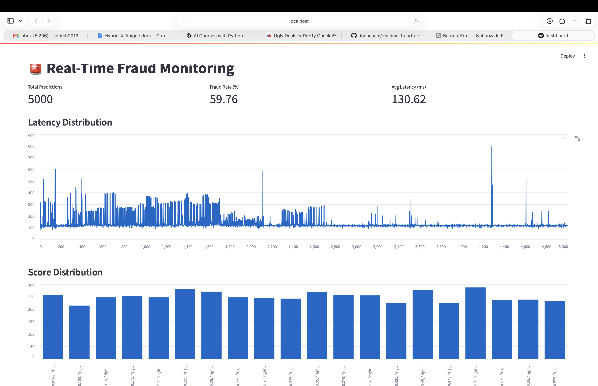

# 🚨 Real-Time Fraud Detection Platform

A real-time fraud detection system built with **Python**, **FastAPI**, **Streamlit**, **Scikit-Learn**, and **SQLite**.

## Features

- Real-time fraud scoring
- Machine Learning prediction model
- REST API using FastAPI
- Interactive Streamlit dashboard
- Latency monitoring
- Fraud rate analytics
- SQLite transaction storage

## Technology Stack

- Python
- FastAPI
- Streamlit
- Scikit-Learn
- SQLite
- Pandas
- NumPy

## Project Structure

```
realtime-fraud-ai/
│
├── models/
├── src/
│   ├── api.py
│   ├── dashboard.py
│   ├── producer.py
│   ├── train.py
│   └── features.py
│
├── requirements.txt
└── README.md
```

## Dashboard

Interactive dashboard showing:

- Fraud Rate
- Latency Distribution
- Prediction Score Distribution
- Real-Time Monitoring
  
## Dashboard Preview



## Installation

```bash
git clone https://github.com/duchesam/realtime-fraud-ai.git

cd realtime-fraud-ai

python -m venv .venv

source .venv/bin/activate

pip install -r requirements.txt
```

Run API

```bash
python -m uvicorn src.api:app --reload
```

Run Producer

```bash
python src/producer.py
```

Run Dashboard

```bash
python -m streamlit run src/dashboard.py
```

## Author

**Ermias Seyoum**

Software Engineer | API Integration | AI | Machine Learning

GitHub:
https://github.com/duchesam
